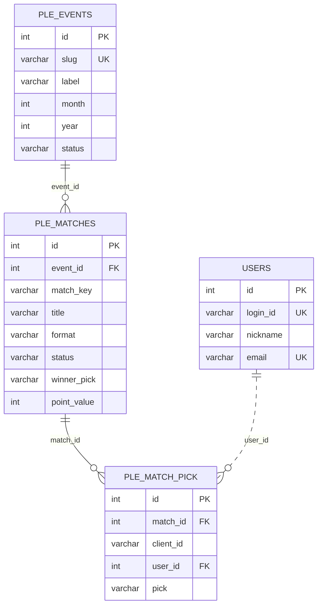
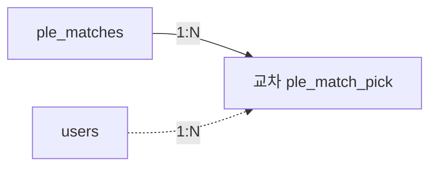
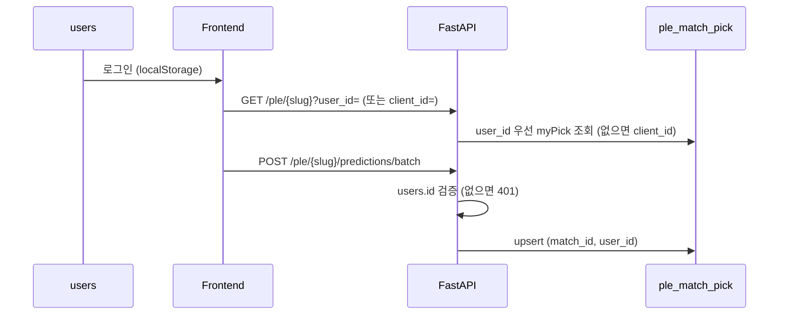
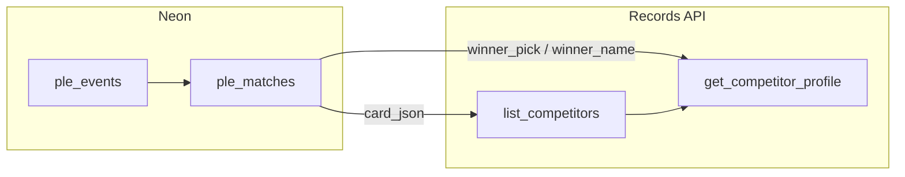
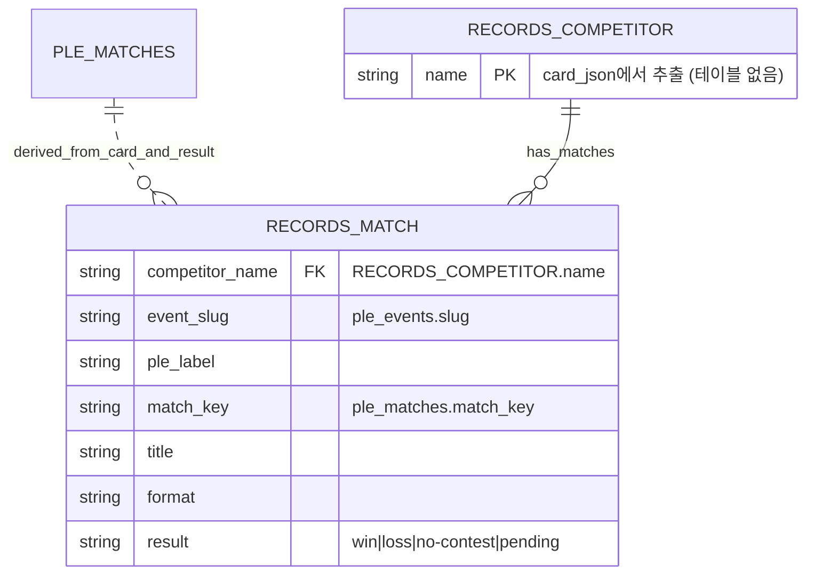
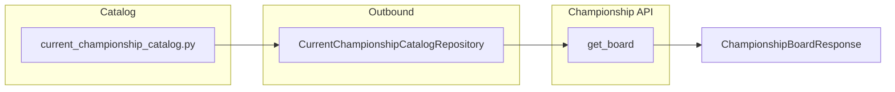
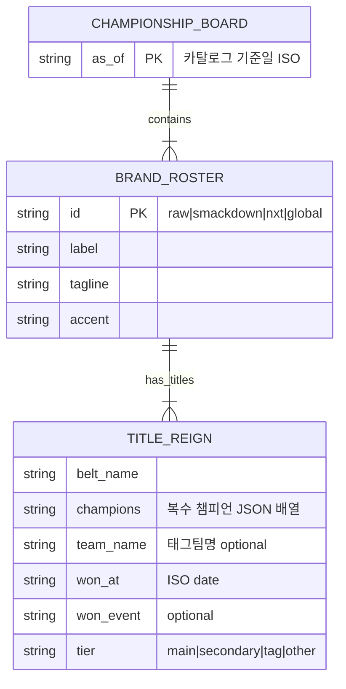
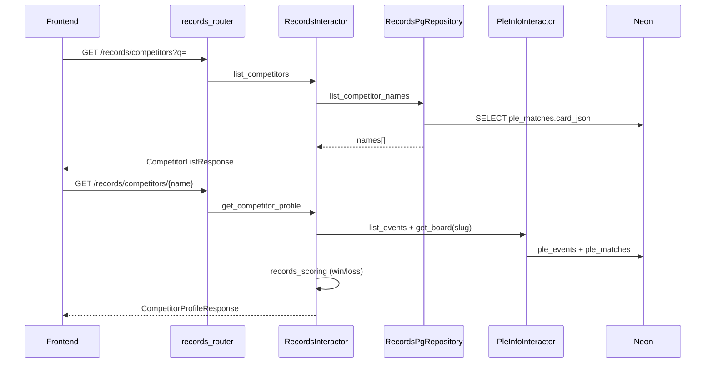
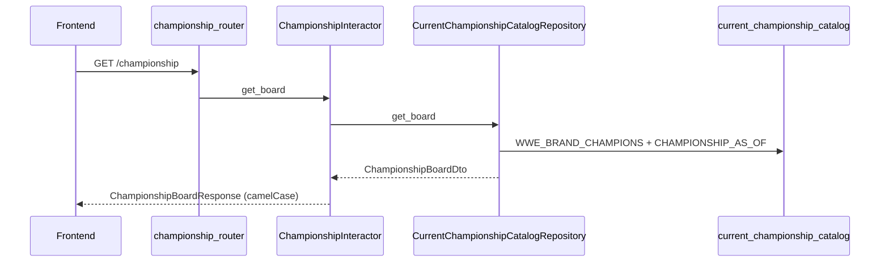

# Kayfabe ERD

Mermaid `erDiagram`은 속성·관계 라벨의 **따옴표·괄호·슬래시** 등에서 파싱 오류가 납니다. 필드 설명은 아래 표를 참고하세요.

WWE PLE(프리미엄 라이브 이벤트) 예측·결과를 Neon Postgres에 저장하는 Kayfabe 도메인 스키마입니다.  
ORM: `sangho/apps/kayfabe/adapter/outbound/orm/ple_orm.py` · 회원 FK: Neon `users` 테이블 (`friday13th.domain.entities.user_model.UserModel` 참조 · `oracle_database.init_db`에서 secom/friday13th 모델 로드).

**선수 기록(Records)** 은 별도 테이블 없이 `ple_matches.card_json`(출전 선수)과 `ple_matches` 결과 필드(`winner_pick`, `winner_name`)를 조합해 **읽기 전용 집계**로 제공합니다.

**현역 챔피언십(Championship)** 은 별도 테이블 없이 `app/services/current_championship_catalog.py` 정적 카탈로그를 **읽기 전용**으로 제공합니다. 브랜드(Raw·SmackDown·NXT·공통)별로 메인·2선·태그·기타 타이틀 티어를 구분합니다.



> **교차 엔티티 `PLE_MATCH_PICK`** = 물리 `ple_predictions`.  
> `users` ↔ `ple_matches` **직접 선 없음** · M:N은 `경기 1:N 교차` + `회원 1:N 교차`로만 해소.  
> `USERS ||..o{` = **1:N 비식별** 점선 (`}o..o{`는 M:N처럼 보이므로 사용 안 함).

## 관계

| 관계 | 카디널리티 | 유형 | 설명 |
|------|------------|------|------|
| PLE_EVENTS → PLE_MATCHES | 1 : 0..N | 식별 | `event_id` NOT NULL · CASCADE · UK `(event_id, match_key)` |
| PLE_MATCHES → PLE_MATCH_PICK | 1 : 0..N | 식별 | `match_id` NOT NULL · CASCADE · UK `(match_id, client_id)` |
| USERS → PLE_MATCH_PICK | 1 : 0..N | 비식별 | `user_id` nullable · SET NULL · API `userId` 필수 · **M:N 아님** |
| USERS ↔ PLE_MATCHES | **없음** | — | **교차 `PLE_MATCH_PICK`으로만** 연결 |

---

## PK · 인조키 정책

| 테이블 | 논리 PK (비즈니스) | 물리 PK (ORM·Neon) | `id` 인조키 |
|--------|-------------------|-------------------|-------------|
| `ple_events` | `slug` | `id` + `slug` UK | **불필요** (논리). 물리는 ENTITY_RULE로 `id` 유지 |
| `ple_matches` | `(event_id, match_key)` | `id` + UK `(event_id, match_key)` | **불필요** (논리). FK `event_id`가 부모 식별자 |
| `ple_match_pick` (교차) | `(match_id, client_id)` | 물리 테이블 `ple_predictions` · `id` + UK | 경기·브라우저 참가를 연결. `user_id`는 PK 밖 FK |
| `users` (외부) | `id` | `id` | **필요** (secom/friday13th 공유 Neon 테이블) |

- **논리:** 자식 행은 부모 없이 존재할 수 없으면 PK에 부모 FK(또는 slug)가 포함되는 **식별관계**로 모델링한다.
- **물리:** `sangho/_claude/ENTITY_RULE`에 따라 **모든 테이블**에 `int id` autoincrement PK를 둔다. 비즈니스 중복 방지는 **UK**로 처리한다.

---

## 식별 · 비식별 관계

| 부모 | 자식 | 유형 | 설명 |
|------|------|------|------|
| `ple_events` | `ple_matches` | **식별** | 경기는 이벤트 없이 정의되지 않음. 논리 PK에 `event_id`(또는 `slug`) 포함 |
| `ple_matches` | `ple_match_pick` | **식별** | 픽(예측)은 경기 없이 없음. 논리 PK `(match_id, client_id)` |
| `users` | `ple_match_pick` | **비식별** | `user_id`는 PK에 **미포함**. **신규 예측 API는 `userId` 필수** · DB는 레거시 NULL 허용 · 회원 삭제 시 SET NULL |

| 부모 → 자식 | 유형 | Mermaid (중간) | 렌더 |
|-------------|------|----------------|------|
| `ple_events` → `ple_matches` | 식별 | `\|\|--o{` | **실선** · 자식 0건 허용 |
| `ple_matches` → `ple_match_pick` | 식별 | `\|\|--o{` | **실선** · 자식 0건 허용 |
| `users` → `ple_match_pick` | 비식별 | `\|\|..o{` + `..` | **점선** · 1:N (M:N **`}o..o{` 아님**) |

```text
식별:     자식.PK ⊃ 부모 FK(또는 slug)   CASCADE              Mermaid 중간: --
비식별:   자식.FK only, PK 밖           users 삭제 → SET NULL   Mermaid 중간: ..
카디널리티: o{ = 0건 이상 (||--o{)  ·  |{ = 1건 이상 (||--|{, 본 스키마 미사용)
비식별 1:N: `\|\|..o{` (중간 `..`) → 점선 · **`}o..o{`는 M:N 표기**
```

> `users`와 `ple_match_pick`만 보면 M:N처럼 보일 수 있으나, **둘 사이에 직접 선을 두지 않고** 가운데 **교차 엔티티**를 두면 `경기 1:N 교차` + `회원 1:N 교차`로 해소됩니다.

---

## 교차 엔티티 (`ple_match_pick`)

`users` ↔ `ple_matches`는 **직접 연결하지 않습니다.**  
한 회원이 여러 경기에, 한 경기에 여러 회원이 참여하면 **논리적 M:N**이 되므로, 가운데 **교차(연관) 엔티티 `ple_match_pick`** 이 필요합니다.

| 구분 | 설명 |
|------|------|
| 논리 이름 | `ple_match_pick` — 「한 경기 + 한 참가(브라우저)」당 승자 예측 1건 |
| 물리 테이블 | **`ple_predictions`** (별도 junction 테이블 없음, 1테이블이 교차 엔티티 역할) |
| 경기 쪽 | `match_id` FK · UK `(match_id, client_id)` → 경기에 **식별** |
| 회원 쪽 | `user_id` FK → 회원에 **비식별** (PK 아님) · **저장·조회 upsert 키: `(match_id, user_id)`** |
| M:N 해소 | `ple_matches` **1:N** `ple_match_pick` **N:1** `users` (한 회원·여러 경기 픽) |

```text
ple_events ══1:N══► ple_matches ══1:N══► ple_match_pick ··· N:1 ··· users
           (실선)              (실선)         (교차·물리 ple_predictions)
                                              신규 예측: userId 필수 (API)
```

| 저장·조회 기준 | 키 | 용도 |
|----------------|-----|------|
| 논리 UK (브라우저) | `(match_id, client_id)` | 기기·세션 단위 중복 방지 |
| 논리 UK (회원) | `(match_id, user_id)` | 로그인 회원 경기당 1픽 · **upsert·`myPick` 조회** |
| API | `userId` + `clientId` | 예측 POST 시 `userId` **필수** (미제공 → **422** · 무효 id → **401**) |

---

## ER 다이어그램 (논리)

`users`와 `ple_matches` 사이 **직선 없음** · 가운데 `ple_match_pick`이 유일한 연결.



| 논리 관계 | 표기 | 설명 |
|-----------|------|------|
| `ple_matches` → `ple_match_pick` | 1 : 0..N 식별 | `match_id`가 논리 UK 일부 |
| `users` → `ple_match_pick` | 1 : 0..N 비식별 | `user_id`는 FK만 |
| `users` ↔ `ple_matches` | 없음 | M:N은 교차로만 해소 |

물리 테이블 매핑은 **문서 상단 `erDiagram`** 참고.

| 논리 ER | 물리 테이블 | 논리 PK (UK) | 물리 PK |
|---------|-------------|---------------|---------|
| `ple_events` | `ple_events` | `slug` | `id` |
| `ple_matches` | `ple_matches` | `(event_id, match_key)` | `id` |
| **`ple_match_pick`** | **`ple_predictions`** | `(match_id, client_id)` | `id` |
| `users` (외부) | `users` | `id` | `id` |

**선·관계 읽는 법**

| 연결 | Mermaid | ER |
|------|---------|-----|
| `ple_events` → `ple_matches` | `\|\|--o{` + `--` | 1:0..N **식별** |
| `ple_matches` → `ple_match_pick` | `\|\|--o{` + `--` | 1:0..N **식별** |
| `users` → `ple_match_pick` | `\|\|..o{` + `..` | 1:0..N **비식별** |

**애플리케이션:** `POST …/predict` · `…/predictions/batch` → body `userId` **필수** (미제공 422 · 무효 id 401) · upsert → `(match_id, user_id)` · `myPick` → `user_id` 우선, 없으면 `client_id`.

**UK:** `uq_ple_event_match_key` · `uq_ple_prediction_match_client` · `uq_predictions_match_user`

---

## 카디널리티

| 관계 | ER 표기 | 유형 | Mermaid | 의미 |
|------|---------|------|---------|------|
| `ple_events` → `ple_matches` | **1 : 0..N** | 식별 | `\|\|--o{` 실선 | 한 PLE에 0건 이상 경기 · sync 전 경기 없음 가능 |
| `ple_matches` → `ple_match_pick` | **1 : 0..N** | 식별 | `\|\|--o{` 실선 | 한 경기에 0건 이상 픽 · 예측 전 0건 가능 |
| (경기 + `client_id`) → 픽 | **1 : 1** | — | — | 브라우저당 경기 1회 (`uq_ple_prediction_match_client`) |
| (경기 + `user_id`) | **1 : 1** | — | — | 로그인·`user_id` NOT NULL 시 경기당 1회 (`uq_predictions_match_user`) |
| `users` → `ple_match_pick` | **1 : 0..N** | 비식별 | `\|\|..o{` 점선 | 회원당 0건 이상 픽 · **M:N 아님** |
| `users` ↔ `ple_matches` | **없음** | — | — | **교차 엔티티**로만 연결 |

---

## 제약 조건

| 이름 | 테이블 | 규칙 |
|------|--------|------|
| `uq_ple_event_match_key` | `ple_matches` | `(event_id, match_key)` 유일 |
| `uq_ple_prediction_match_client` | `ple_predictions` | `(match_id, client_id)` 유일 |
| `uq_predictions_match_user` | `ple_predictions` | `(match_id, user_id)` UK (ORM `UniqueConstraint` · Postgres는 `user_id IS NULL` 행은 UK 미적용) |
| FK CASCADE | `ple_matches` → `ple_events` | 이벤트 삭제 시 경기·예측 연쇄 삭제 |
| FK CASCADE | `ple_predictions` → `ple_matches` | 경기 삭제 시 예측 연쇄 삭제 |
| FK SET NULL | `ple_predictions.user_id` → `users` | 회원 삭제 시 `user_id`만 NULL |
| API | predict · predict batch | body `userId` 필수 · 미제공 → **422** (Pydantic) · DB에 없는 id → **401** (`PleAuthRequiredError`) |

---

## 예측 흐름 (로그인 필수)



---

## 테이블 · 필드 설명

### `ple_events` (`PleEventModel`)

| 필드 | 타입 | 키 | 설명 |
|------|------|-----|------|
| id | int | PK (물리) | ENTITY_RULE 인조키 |
| slug | varchar(64) | UK · **논리 PK** | URL·프론트 식별자 |
| label | varchar(120) | | 표시 이름 |
| month | int | | PLE 월별 순서 |
| year | int | | 연도 |
| status | varchar(20) | | `upcoming` · `live` · `finished` |
| finished_at | timestamptz | | 이벤트 종료 시각 |
| created_at | timestamptz | | 생성 |
| updated_at | timestamptz | | 갱신 |

### `ple_matches` (`PleMatchModel`)

| 필드 | 타입 | 키 | 설명 |
|------|------|-----|------|
| id | int | PK (물리) | ENTITY_RULE 인조키 |
| event_id | int | FK · **논리 PK 일부** | `ple_events.id` |
| match_key | varchar(80) | **논리 PK 일부** | 프론트 카드 `id` |
| title | varchar(200) | | 경기 제목 |
| format | varchar(20) | | `singles` · `multi` |
| card_variant | varchar(10) | | `sideA` · `sideB` |
| sort_order | int | | 카드 정렬 |
| card_json | text | | 선수·배당 JSON |
| status | varchar(20) | | `scheduled` · `live` · `finished` |
| winner_pick | varchar(20) | | 방송 결과 |
| winner_name | varchar(200) | | 승자 표시명 |
| ai_pick | varchar(20) | | AI 예측 |
| ai_pick_name | varchar(200) | | AI 예측 표시명 |
| ai_correct | boolean | | AI 정답 여부 |
| point_value | int | | 순위 가중치 |
| finished_at | timestamptz | | 결과 확정 시각 |
| created_at | timestamptz | | 생성 |
| updated_at | timestamptz | | 갱신 |

### `ple_match_pick` · 물리 `ple_predictions` (`PlePredictionModel`)

논리 **교차 엔티티**. ORM·Neon 테이블명은 `ple_predictions`입니다.

| 필드 | 타입 | 키 | 설명 |
|------|------|-----|------|
| id | int | PK (물리) | ENTITY_RULE 인조키 |
| match_id | int | FK · **논리 PK 일부** | `ple_matches.id` |
| client_id | varchar(64) | **논리 PK 일부** · UK | 기기 식별 · API와 함께 전송 |
| user_id | int | FK (비식별) · UK `(match_id, user_id)` | `users.id` · **신규 예측 API 필수** · DB nullable(레거시) |
| pick | varchar(20) | | `left` · `right` · `"0"`… |
| created_at | timestamptz | | 예측 시각 |

### `users` (외부 도메인, 참조)

Kayfabe 코드는 `friday13th.domain.entities.user_model.UserModel`을 import합니다. Neon `users` 테이블은 secom·friday13th가 공유합니다.

| 필드 | 타입 | 키 | 설명 |
|------|------|-----|------|
| id | int | PK | 외부 도메인 인조키 |
| login_id | varchar | UK | 로그인 ID |
| nickname | varchar | | 닉네임 |
| email | varchar | UK | 이메일 |

---

## 상태 값

| 구분 | 값 | 용도 |
|------|-----|------|
| 이벤트 status | upcoming, live, finished | PLE 전체 |
| 경기 status | scheduled, live, finished | 개별 매치 |
| pick / winner_pick | left, right, 0..n | singles / multi |

---

## `card_json` 구조 (요약)

| format | 주요 키 | Records 활용 |
|--------|---------|--------------|
| singles | `left`, `right`, `bookmakerDecimal` | `left.name` / `right.name` · `isChampion` → `wasChampion` |
| multi | `competitors[]`, `bookmakerDecimal` | `competitors[].name` · 럼블 `다른 선수` 제외 |

---

## 선수 기록 (Records) — 논리 모델

물리 테이블은 **추가하지 않습니다.** Neon에 동기화된 PLE 카드·경기 결과를 읽어 API로 집계합니다.

> 참고: 아래 ER(물리) 다이어그램(테이블/FK)에는 `records`가 나오지 않습니다.  
> `records`는 **테이블이 아니라 파생 집계(view-like)** 이기 때문입니다.



| 구분 | 설명 |
|------|------|
| 논리 엔티티 | **competitor** — `card_json`에 등장하는 선수·팀명 (별도 `competitors` 테이블 없음) |
| 목록 출처 | `ple_matches.card_json` 전 행 파싱 · `다른 선수`(럼블 기타) 제외 |
| 프로필 출처 | `PleInfoUseCase.get_board()` — 이벤트별 `MatchBoardSchema` |
| 승패 판정 | `app/services/records_scoring.py` — `win` · `loss` · `no-contest` · `pending` |
| 승률 | `wins / (wins + losses)` (무효·대기 제외) |

### 파생 ER (논리) — Records View

아래는 “DB 테이블”이 아니라, `records` API가 반환하는 **파생 엔티티(뷰)** 를 논리적으로 그린 것입니다.



### 경기 결과 판정 규칙

| `result` | 조건 |
|----------|------|
| `pending` | `MatchBoardSchema.result` 없음 (결과 미확정) |
| `no-contest` | 결과는 있으나 승자 이름 추론 불가 |
| `win` | 추론된 `winnerName` == 선수명 (정규화 후 비교) |
| `loss` | 경기 참가했으나 승자가 아님 |

승자 추론 순서: `result.winnerName` → multi면 `winnerIndex` → singles면 `winnerSide`(`left`/`right`).

### API 응답 스키마 (`records_schema.py`)

| 스키마 | 필드 (camelCase) | 설명 |
|--------|------------------|------|
| `CompetitorListResponseSchema` | `names` | 출전 선수명 목록 |
| `CompetitorProfileResponseSchema` | `name`, `matches`, `summary` | 선수 프로필 |
| `CompetitorSummarySchema` | `total`, `wins`, `losses`, `noContest`, `pending`, `singlesTotal`, `multiTotal`, `championAppearances` | 요약 통계 |
| `CompetitorMatchRecordSchema` | `slug`, `pleLabel`, `matchKey`, `title`, `format`, `result`, `winnerName`, `opponents`, `participants`, `wasChampion` | 경기별 기록 |

---

## 현역 챔피언십 (Championship) — 논리 모델

물리 테이블은 **추가하지 않습니다.** 외부 기준일 카탈로그(`current_championship_catalog.py`)를 `ChampionshipRepository`가 읽어 API로 제공합니다.

> 참고: 아래 ER(물리) 다이어그램(테이블/FK)에는 `championship`이 나오지 않습니다.  
> `championship`은 **테이블이 아니라 카탈로그 기반 읽기 전용 보드**이기 때문입니다.



| 구분 | 설명 |
|------|------|
| 논리 엔티티 | **brand_roster** — Raw / SmackDown / NXT / global 브랜드 단위 챔피언 묶음 |
| 타이틀 행 | **title_reign** — 벨트명·현 챔피언(복수 가능)·획득일·이벤트·티어 |
| 데이터 출처 | `app/services/current_championship_catalog.py` · `CHAMPIONSHIP_AS_OF` 기준일 |
| 티어 (`tier`) | `main` 메인 · `secondary` 2선 · `tag` 태그팀 · `other` Speed/Evolve/ID 등 |
| 브랜드 (`id`) | `raw` · `smackdown` · `nxt` · `global` |
| UI 악센트 (`accent`) | `red` · `blue` · `gold` · `purple` — 프론트 브랜드 테마용 |

### 파생 ER (논리) — Championship Board



### API 응답 스키마 (`championship_schema.py`)

| 스키마 | 필드 (camelCase) | 설명 |
|--------|------------------|------|
| `ChampionshipBoardResponseSchema` | `asOf`, `brands` | 전체 챔피언 보드 |
| `BrandRosterSchema` | `id`, `label`, `tagline`, `accent`, `titles` | 브랜드별 묶음 |
| `TitleReignSchema` | `beltName`, `champions`, `teamName`, `wonAt`, `wonEvent`, `tier` | 벨트 1건 |

### 백엔드 파일 매핑 (Championship)

| 레이어 | 파일 |
|--------|------|
| 카탈로그 | `app/services/current_championship_catalog.py` |
| DTO | `app/dtos/championship_dto.py` |
| Input port | `app/ports/input/championship_use_case.py`, `championship.py` |
| Output port | `app/ports/output/championship_repository.py` |
| Interactor | `app/use_cases/championship_interactor.py` |
| Catalog adapter | `adapter/outbound/catalog/current_championship_catalog_repository.py` |
| Schema | `adapter/inbound/api/schemas/championship_schema.py` |
| Router | `adapter/inbound/api/v1/championship_router.py` |
| DI | `dependencies/championship_provider.py` |

흐름: **championship_router → ChampionshipInteractor → CurrentChampionshipCatalogRepository → catalog** (Neon 미사용)

---

## 레이어드 구조 (`sangho/apps/kayfabe`)

titanic 앱과 동일한 헥사고날(포트·어댑터) 구조입니다.

| 레이어 | 경로 | 역할 |
|--------|------|------|
| Router | `adapter/inbound/api/v1/*_router.py` | HTTP 진입 · 스키마 검증 |
| Schema | `adapter/inbound/api/schemas/` | Pydantic 요청·응답 DTO (`ple`, `ranking`, `result`, `records`, `title_history`, **`championship`**) |
| Router 집계 | `adapter/inbound/api/__init__.py` | `kayfabe_router` (7개 v1 라우터) |
| DIP | `dependencies/*.py` | UseCase 조립 (팩토리) |
| Input port | `app/ports/input/*.py` | 유스케이스 인터페이스 |
| Interactor | `app/use_cases/*_interactor.py` | 비즈니스 로직 |
| Output port | `app/ports/output/*_repository.py` | 저장소 인터페이스 |
| PG adapter | `adapter/outbound/pg/*_pg_repository.py` | Neon CRUD·조회 |
| Catalog adapter | `adapter/outbound/catalog/*_catalog_repository.py` | 정적 카탈로그 읽기 (**`championship`**) |
| ORM | `adapter/outbound/orm/ple_orm.py` | SQLAlchemy 모델 |
| Domain service | `app/services/` | `ple_ai`, `ple_scoring`, **`records_scoring`**, **`current_championship_catalog`** |
| DTO | `app/dtos/` | `ranking_dto`, `records_dto`, **`championship_dto`**, `title_history_dto` 등 |

### 기능별 파일 매핑

| 기능 | Router | dependencies | Input port | Interactor | Output port | PG adapter | Schema |
|------|--------|--------------|------------|------------|-------------|------------|--------|
| PLE 쓰기 | `ple_router` | `ple.py` | `ple` | `ple_interactor` | `ple_repository` | `ple_pg_repository` | `ple_schema` |
| PLE 조회 | `pleinfo_router` | `pleinfo.py` | `pleinfo` | `pleinfo_interactor` | `pleinfo_repository` | `pleinfo_pg_repository` | `ple_schema` |
| 순위 | `ranking_router` | `ranking.py` | `ranking` | `ranking_interactor` | `ranking_repository`, `ple_repository` | `ranking_pg_repository` | `ranking_schema` |
| 결과 목록 | `result_router` | `result.py` | `result` | `result_interactor` | `result_repository` | `result_pg_repository` | `result_schema` |
| **선수 기록** | **`records_router`** | **`records_provider`** | **`records`** | **`records_interactor`** | **`records_repository`** | **`records_pg_repository`** | **`records_schema`** |
| 타이틀 이력 | `title_history_router` | `title_history_provider` | `title_history` | `title_history_interactor` | `title_history_repository` | `title_history_pg_repository` | `title_history_schema` |
| **현역 챔피언십** | **`championship_router`** | **`championship_provider`** | **`championship`** | **`championship_interactor`** | **`championship_repository`** | **`current_championship_catalog_repository`** | **`championship_schema`** |

흐름 (쓰기): **Router → dependencies → Interactor → PgRepository → Neon**  
흐름 (기록): **records_router → RecordsInteractor → RecordsPgRepository**  
흐름 (챔피언십): **championship_router → ChampionshipInteractor → CurrentChampionshipCatalogRepository → catalog**

`main.py` 등록: `app.include_router(kayfabe_router)` 한 줄.

`RecordsInteractor`는 `PleInfoUseCase`에만 의존하고, `PleInfoPgRepository`를 직접 import하지 않습니다 (`dependencies/records.py`에서 조립).

---

## HTTP API

라우터: `kayfabe_router` (`adapter/inbound/api/__init__.py`) · `main.py`에서 단일 등록.

| 메서드 | 경로 | 라우터 | DB 영향 |
|--------|------|--------|---------|
| GET | `/ple/events` | `pleinfo_router` | `ple_events` 목록 |
| GET | `/ple/ai-stats` | `pleinfo_router` | AI 예측 누적 통계 |
| GET | `/ple/{slug}` | `pleinfo_router` | events + matches · `?user_id=` 또는 `?client_id=` 시 `myPick` |
| GET | `/ple/{slug}/live` | `pleinfo_router` | SSE · **`client_id` 필수** · `user_id` optional |
| POST | `/ple/{slug}/sync-from-client` | `ple_router` | events·matches upsert |
| POST | `/ple/{slug}/predictions/batch` | `ple_router` | `ple_predictions` · body `userId` 필수 |
| POST | `/ple/{slug}/matches/{match_key}/predict` | `ple_router` | `ple_predictions` · body `userId` 필수 |
| POST | `/ple/{slug}/results/batch` | `ple_router` | `ple_matches` 결과 일괄 |
| POST | `/ple/{slug}/matches/{match_key}/result` | `ple_router` | `ple_matches` 결과 1건 |
| POST | `/ple/link-predictions` | `ple_router` | **410** (폐기) |
| GET | `/rankings` | `ranking_router` | `user_id` NOT NULL 픽만 집계 · `?nickname=` |
| GET | `/ple/results/results` | `result_router` | 연도별 PLE 이벤트 결과 · `?year=` (기본 2026) |
| GET | `/records/competitors` | `records_router` | `card_json` 기준 출전 선수 목록 · `?q=` 검색 |
| GET | `/records/competitors/{name}` | `records_router` | 선수별 PLE 승패 기록 · 목록에 없는 선수 **404** · 경기 0건이어도 목록에 있으면 **200** |
| GET | `/title-history/competitors/{name}` | `title_history_router` | 선수별 실제 WWE 벨트 획득 이력 (Neon) |
| POST | `/title-history/sync` | `title_history_router` | 실제 타이틀 카탈로그 → Neon 재동기화 |
| GET | `/championship` | `championship_router` | 브랜드별 현역 챔피언 보드 · **DB 없음** · 카탈로그 기준 |

> **선수 목록이 비어 있으면** PLE 카드가 아직 `POST /ple/{slug}/sync-from-client`로 Neon에 동기화되지 않은 상태일 수 있습니다.

---

## 선수 기록 흐름



---

## 챔피언십 흐름



---

## 프론트 연동

| 화면 | 경로 | API |
|------|------|-----|
| PLE 목록·예측 | `/ple`, `/ple/[slug]` | sync, predict(batch), live · **로그인 후 예측** |
| 결과 등록 | `/results`, `/results/[slug]` | sync, result(batch·단건), `GET /ple/results/results` |
| **선수 기록** | **`/records`, `/records/[name]`** | **`GET /records/competitors`**, **`GET /records/competitors/{name}`** · `www/lib/records-api.ts` |
| **현역 챔피언십** | **`/championship`** | **`GET /championship`** · `www/lib/championship-api.ts` · `components/championship/championship-board.tsx` |
| 순위표 | `/rankings` | `GET /rankings` · `www/lib/rankings-api.ts` |
| 내 정보 | `/my-info` | `GET /rankings?nickname=` |

---

## 3NF · ER 체크리스트

- [ ] 논리 PK: `slug` · `(event_id, match_key)` · `(match_id, client_id)` — 교차 엔티티 `ple_match_pick`
- [ ] 물리: 모든 테이블 `id` PK · 교차 엔티티 = `ple_predictions` (`sangho/_claude/ENTITY_RULE`)
- [ ] `ple_events` → `ple_matches` → `ple_match_pick` **식별관계**
- [ ] `users` → `ple_match_pick` **1:0..N 비식별** (`||..o{` 점선 · `}o..o{` M:N 아님)
- [ ] `ple_events` → `ple_matches` · `ple_matches` → `ple_match_pick` **1:0..N 식별** (`||--o{` 실선)
- [ ] UK: `uq_ple_event_match_key`, `uq_ple_prediction_match_client`, `uq_predictions_match_user`
- [ ] **Records**: 별도 테이블 없음 · `card_json` + 경기 결과 집계 · `records_scoring` 승패 판정
- [ ] **Records API**: `GET /records/competitors` · `GET /records/competitors/{name}` · `records_router` → `kayfabe_router` 등록
- [ ] **Championship**: 별도 테이블 없음 · `current_championship_catalog.py` · 티어 `main|secondary|tag|other`
- [ ] **Championship API**: `GET /championship` · `championship_router` → `kayfabe_router` 등록 · Catalog adapter (`adapter/outbound/catalog/`)
