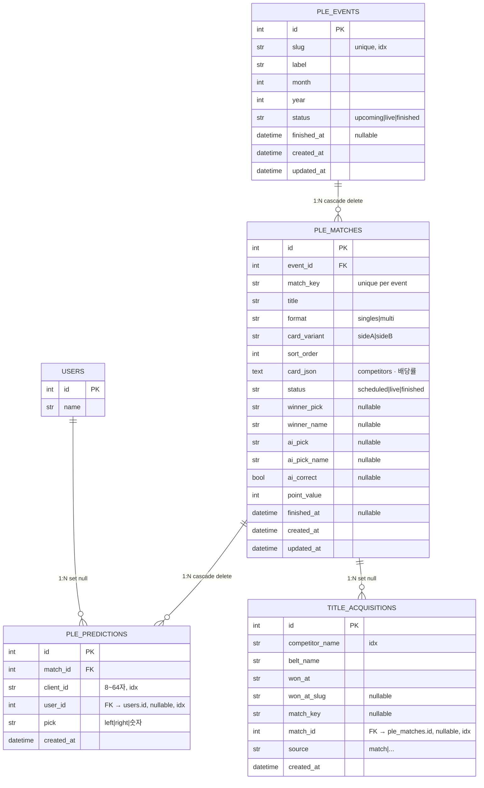

# Kayfabe ERD

> DB 테이블 3개 + 정적 카탈로그 2개 + 집계 파생 엔티티 1개  
> ORM 위치: `adapter/outbound/orm/`

---

## 1. ER 다이어그램



---

## 2. 테이블 상세

### `ple_events`
| 컬럼 | 타입 | 제약 | 설명 |
|------|------|------|------|
| `id` | int | PK, autoincrement | |
| `slug` | varchar(64) | UNIQUE, idx | `ple_260601` 형식 |
| `label` | varchar(120) | NOT NULL | 이벤트 표시명 |
| `month` | int | NOT NULL | |
| `year` | int | NOT NULL, default 2026 | |
| `status` | varchar(20) | NOT NULL | `upcoming` \| `live` \| `finished` |
| `finished_at` | datetime | nullable | 이벤트 종료 시각 |
| `created_at` | datetime | server_default | |
| `updated_at` | datetime | onupdate | |

---

### `ple_matches`
| 컬럼 | 타입 | 제약 | 설명 |
|------|------|------|------|
| `id` | int | PK | |
| `event_id` | int | FK → `ple_events.id`, cascade | |
| `match_key` | varchar(80) | UNIQUE(event_id, match_key) | `match_01` 형식 |
| `title` | varchar(200) | NOT NULL | 경기명 |
| `format` | varchar(20) | NOT NULL | `singles` \| `multi` |
| `card_variant` | varchar(10) | default `sideA` | `sideA` \| `sideB` |
| `sort_order` | int | default 0 | 화면 표시 순서 |
| `card_json` | text | NOT NULL | 선수 목록·배당률 JSON |
| `status` | varchar(20) | NOT NULL | `scheduled` \| `live` \| `finished` |
| `winner_pick` | varchar(20) | nullable | 최종 승자 ID |
| `winner_name` | varchar(200) | nullable | 최종 승자 이름 |
| `ai_pick` | varchar(20) | nullable | AI 예측 ID |
| `ai_pick_name` | varchar(200) | nullable | AI 예측 이름 |
| `ai_correct` | bool | nullable | AI 정답 여부 |
| `point_value` | int | default 1 | 이 경기의 배점 |
| `finished_at` | datetime | nullable | |
| `created_at` | datetime | server_default | |
| `updated_at` | datetime | onupdate | |

> **`card_json` 구조**
> ```json
> {
>   "left":  { "name": "Cody Rhodes", "is_champion": true },
>   "right": { "name": "Gunther",     "is_champion": false },
>   "bookmaker_decimal": { "left": 1.65, "right": 2.30 }
> }
> ```
> `multi` 포맷일 경우 `competitors: [...]` 배열 사용.

---

### `ple_predictions`
| 컬럼 | 타입 | 제약 | 설명 |
|------|------|------|------|
| `id` | int | PK | |
| `match_id` | int | FK → `ple_matches.id`, cascade | |
| `client_id` | varchar(64) | idx | 8~64자 세션 ID |
| `user_id` | int | FK → `users.id`, set null, idx, nullable | |
| `pick` | varchar(20) | NOT NULL | `left` \| `right` \| 숫자 |
| `created_at` | datetime | server_default | |

**유니크 제약**
- `UNIQUE(match_id, client_id)` — 클라이언트당 1예측
- `UNIQUE(match_id, user_id)` — 유저당 1예측

---

### `title_acquisitions`
| 컬럼 | 타입 | 제약 | 설명 |
|------|------|------|------|
| `id` | int | PK | |
| `competitor_name` | varchar(200) | idx | |
| `belt_name` | varchar(200) | NOT NULL | 챔피언십명 |
| `won_at` | varchar(200) | NOT NULL | 획득 이벤트명 |
| `won_at_slug` | varchar(64) | nullable | 이벤트 slug |
| `match_key` | varchar(80) | nullable | 경기 ID |
| `match_id` | int | FK → `ple_matches.id`, set null, idx, nullable | |
| `source` | varchar(20) | default `match` | |
| `created_at` | datetime | server_default | |

**유니크 제약**
- `UNIQUE(match_id, competitor_name)`

---

## 3. DB 외 엔티티

### `championship_titles` (정적 카탈로그)
> DB 테이블 아님. `app/services/current_championship_catalog.py` 에서 메모리 로딩.  
> Neon에 저장 시: `adapter/outbound/orm/championship_orm.py` → `championship_titles` 테이블.

| 필드 | 타입 | 설명 |
|------|------|------|
| `brand_id` | str | `raw` \| `smackdown` \| `nxt` \| `global` |
| `belt_name` | str | 챔피언십명 |
| `champions_json` | str | 현 챔피언 배열 JSON |
| `team_name` | str \| None | 태그팀명 |
| `won_at` | str | 획득 이벤트명 |
| `won_event` | str \| None | 획득 이벤트 slug |
| `tier` | str | `main` \| `secondary` \| `tag` \| `other` |
| `as_of` | str | 데이터 기준일 |

---

### `competitor_records` (집계 파생)
> DB 테이블 없음. `ple_matches.card_json` + `winner_name` 을 `records_scoring.py` 가 집계.

| 필드 | 타입 | 설명 |
|------|------|------|
| `name` | str | 선수명 |
| `result` | str | `win` \| `loss` \| `no-contest` \| `pending` |
| `format` | str | `singles` \| `multi` |
| `was_champion` | bool | 경기 시 챔피언 여부 |
| `opponents` | list[str] | 상대 선수 목록 |

---

## 4. Value Objects / Enums

| 분류 | 값 |
|------|---|
| **PleEventStatus** | `upcoming` · `live` · `finished` |
| **PleMatchStatus** | `scheduled` · `live` · `finished` |
| **MatchFormat** | `singles` · `multi` |
| **CardVariant** | `sideA` · `sideB` |
| **ChampionshipTier** | `main` · `secondary` · `tag` · `other` |
| **BrandId** | `raw` · `smackdown` · `nxt` · `global` |
| **BrandAccent** | `red` · `blue` · `gold` · `purple` |
| **TitleAcquisitionSource** | `match` · (기타) |

---

## 5. 관계 요약

```
ple_events (1) ──────────── (N) ple_matches
                                    │
                     ┌──────────────┼─────────────────┐
                     ▼                                 ▼
             ple_predictions (N)           title_acquisitions (N)
             └── users.id (FK, set null)   └── match_id (FK, set null)
```

- `ple_events` 삭제 → `ple_matches` cascade delete → `ple_predictions` cascade delete
- `ple_matches` 삭제 → `title_acquisitions.match_id` set null
- `users` 삭제 → `ple_predictions.user_id` set null
- `championship_titles` / `competitor_records` 는 DB 관계 없음

---

## 6. 외부 참조

- `users` 테이블: `user` 앱 관리 (`user.domain.entities.user_model`)
- ORM 파일: `adapter/outbound/orm/ple_orm.py` · `championship_orm.py` · `title_history_orm.py`
