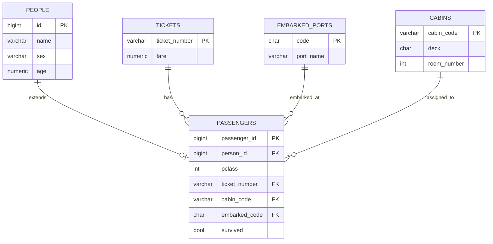
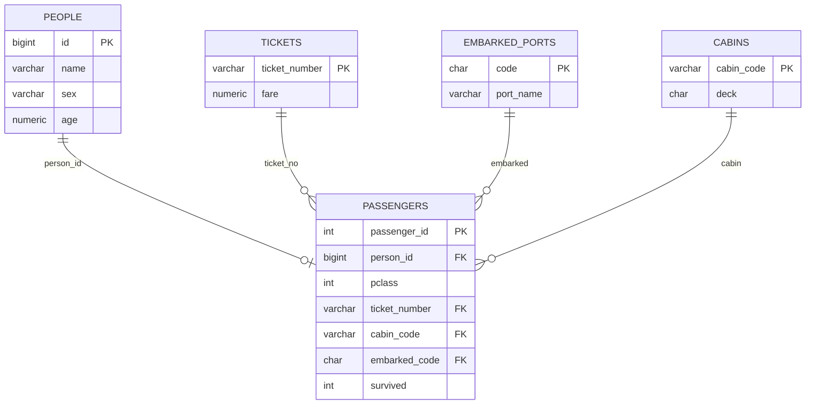

# Titanic ERD

Mermaid `erDiagram`은 속성·관계 라벨의 **따옴표·괄호·슬래시** 등에서 파싱 오류가 납니다. 필드 설명은 아래 표를 참고하세요.

## 관계

| 관계 | 설명 |
|------|------|
| PEOPLE → PASSENGERS | 1:0..1, 상속/확장 (`person_id` → `PEOPLE.id`) |
| TICKETS → PASSENGERS | 1:N, 티켓 보유 |
| EMBARKED_PORTS → PASSENGERS | 1:N, 승선 항구 |
| CABINS → PASSENGERS | 1:N, 객실 배정 |

## 필드 설명

| 엔티티 | 필드 | 설명 |
|--------|------|------|
| PEOPLE | name | 이름 |
| PEOPLE | sex | 성별 |
| PEOPLE | age | 나이 |
| PASSENGERS | person_id | PEOPLE.id 참조 |
| PASSENGERS | pclass | 티켓 클래스 (1, 2, 3) |
| PASSENGERS | ticket_number | TICKETS.ticket_number |
| PASSENGERS | cabin_code | CABINS.cabin_code |
| PASSENGERS | embarked_code | EMBARKED_PORTS.code |
| PASSENGERS | survived | 생존 여부 (false=사망, true=생존) |
| TICKETS | fare | 운임 요금 |
| CABINS | deck | 구역 (A~G, T 등) |
| CABINS | room_number | 방 번호 |
| EMBARKED_PORTS | code | C, Q, S |
| EMBARKED_PORTS | port_name | Cherbourg, Queenstown, Southampton |ERD

Kaggle 타이타닉 명단 · **이진 분류** (6개 독립변수 → `Survived` 0/1).  
ORM: `backend/apps/titanic/adapter/outbound/orm/person_orm.py`, `booking_orm.py` → Neon **`titanic_persons`**, **`titanic_bookings`** (아래 개념 ER은 CSV·분석용).

| 관계 | 카디널리티 |
|------|------------|
| PEOPLE → PASSENGERS | 1 : 0..1 |
| TICKETS / CABINS / EMBARKED_PORTS → PASSENGERS | 1 : N |

**타깃:** `survived` · **특성:** pclass, sex, age, sibsp, parch, fare (CSV·`PassengerSchema`와 동일 의미)  
**Neon 컬럼:** `passenger_id`, `survived`, `pclass`, `name`, `sex`, `age`, `sibsp`, `parch`, `ticket`, `fare`, `cabin`, `embarked`
